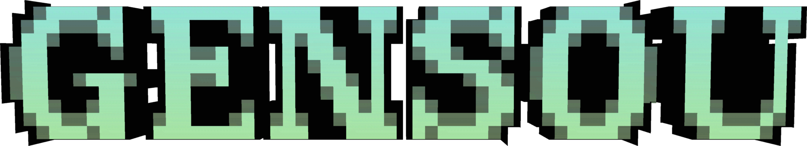

  <!--  -->
  <h1>Gensou</h1>
  
A lean, zero-bloat, high-FPS Fabric modpack optimized for multiplayer that just works. Comes with proximity chat, controller support, and Sodium performance out of the box.

  

    
  

  

    
    
  

  

    
    
  

Gensou boosts your FPS without stripping away the features that make modern Minecraft playable. Originally put together just for my friends, it serves as a pre-configured, "ready-to-play" client for anyone who wants a clean setup without the headache of building a mod list from scratch.

### Features

* Squeezes every last drop of FPS out of your hardware using Sodium, Lithium, and FerriteCore so your game actually runs smoothly.
* Includes Simple Voice Chat right out of the box, making it effortless to jump onto a server and start talking to your friends instantly.
* Features native controller support through Controlify if you'd rather sit back and play with a controller instead of a keyboard.
* Cleans up your inventory clutter with a single click using Client Sort, keeping things organized without the manual hassle.
* Adds proper borderless windowed mode so you can alt-tab to Discord or look up a recipe without the game freezing or minimizing.
* Caches chunks using Bobby, letting you see way past the server's default render distance limit.

### Resource Packs & OptiFine Parity

To keep the pack running as fast as possible, Gensou doesn't include OptiFine replacement mods (like EMF, ETF, or OptiGUI) by default. If you use custom resource packs that require special entity models (like Fresh Animations) or fancy custom GUIs, you can easily drop those specific mods into your `mods` folder manually.

## Versioning

Gensou uses a straightforward pattern to show exactly what's changed between updates:

**Minecraft Version + Modpack Version** (Example: `26.1.2-1.0.0`)

* Major (`?.x.x`) - Big changes, like adding new mods or removing existing ones.
* Minor (`x.?.x`) - Config tweaks, setting adjustments, or smaller mod swaps.
* Patch (`x.x.?`) - Basic mod updates, quick bug fixes, or routine maintenance.

When Minecraft gets a major update, the modpack version resets to `1.0.0` so we can start fresh on the new game version.

### Documentation & Support

For a complete guide on features, commands, and configuration, please visit our [wiki](https://docs.maboroshi.org). If you have questions or need to report a bug, join our [Discord server](https://discord.maboroshi.org).
