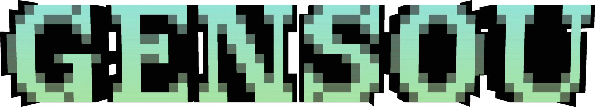

  <!--  -->
  <h1>Gensou</h1>
  
A clean, high-performance Fabric client built for modern multiplayer. Full resource pack parity, proximity voice chat, and extended view distance out of the box.

  

    
  

  

    
    
  

  

    
    
  

Gensou is a focused client designed to give players a smooth, complete visual experience on modern multiplayer servers without the bloat of kitchen-sink modpacks. It pairs modern rendering optimizations with full support for custom resource packs, server voice chat, and extended render distances.

### Features

* High-performance rendering pipeline powered by Sodium, Lithium, and FerriteCore for high frame rates and low memory consumption.
* Native shader support and full OptiFine resource pack parity, including custom entity models (EMF), random entity textures (ETF), connected textures (Continuity), custom container GUIs (OptiGUI), and custom skies (Skyboxify).
* Local chunk caching with Bobby, allowing you to see far beyond restrictive server-side render distance limits.
* Built-in Simple Voice Chat integration for instant proximity audio on supported servers.
* Practical quality-of-life additions including extended chat scrollback, faster server list polling, and clean hunger/saturation displays.
* Zero gameplay alterations, controller frameworks, or unnecessary background tools.

## Versioning

Gensou follows a structured release pattern:

**Minecraft Version + Modpack Version** (Example: `26.3-1.0.0`)

* Major (`?.x.x`) - Mod additions, structural removals, or engine upgrades.
* Minor (`x.?.x`) - Configuration updates, mod swaps, or behavioral adjustments.
* Patch (`x.x.?`) - Dependency updates and stability fixes.

When Minecraft receives a major version release, the modpack version resets to `1.0.0`.

### Documentation & Support

For setup details and troubleshooting, check out the [documentation](https://docs.maboroshi.org) or visit the [Discord community](https://discord.maboroshi.org).
